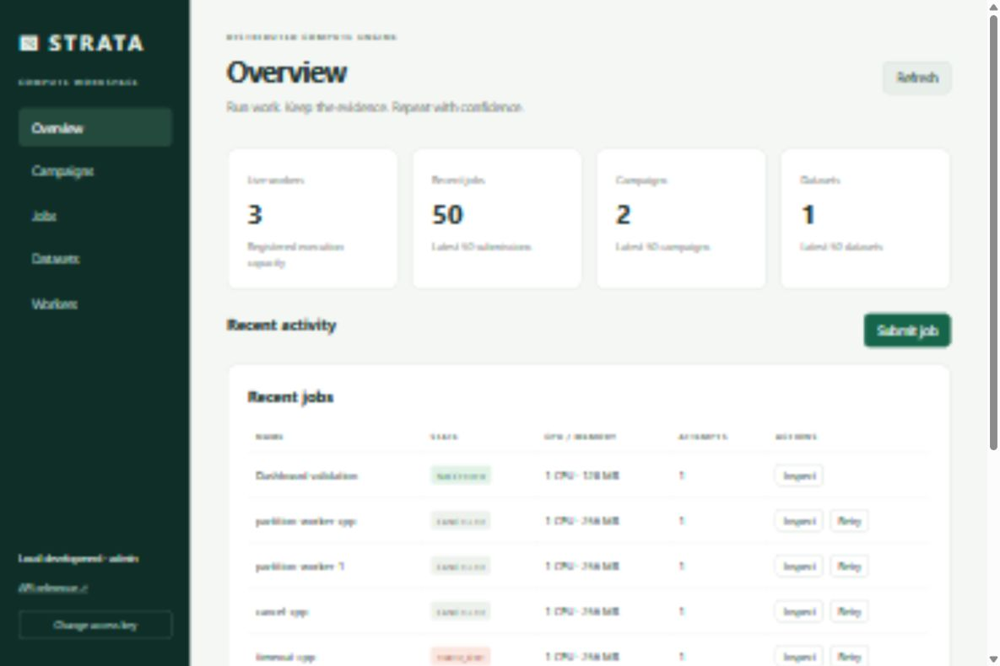
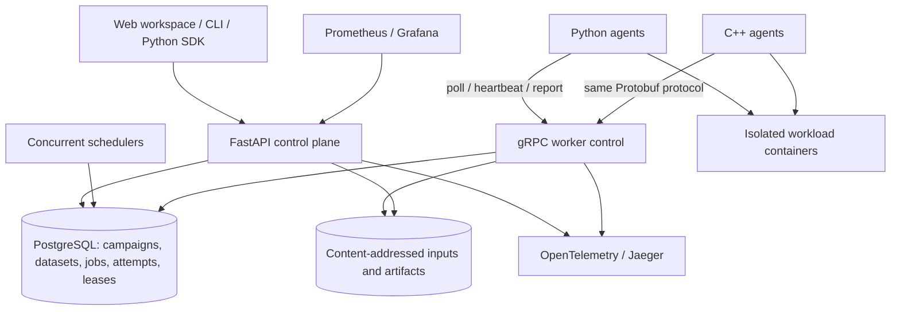
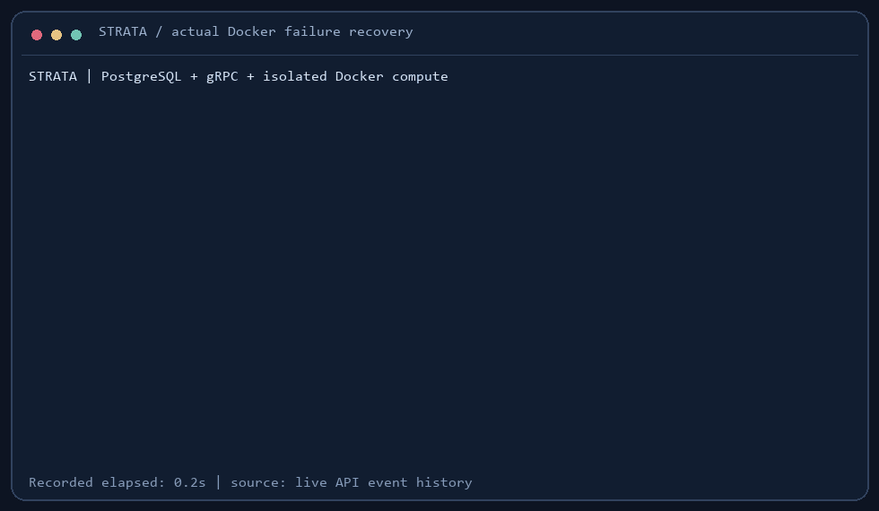

# Strata

[](https://github.com/gragi-1/strata-compute-engine/actions/workflows/ci.yml)

A compute workspace for running containerized programs, organizing datasets, executing parameter sweeps and dependency workflows, and collecting reproducible results. Durable scheduling and recovery are backed by PostgreSQL and fenced leases; Python and C++ worker agents execute the jobs.

**The v2 workspace has been validated locally.** Consult [release history](https://github.com/gragi-1/strata-compute-engine/releases) for published versions; the CI badge reflects pushed commits. See [v2 validation](docs/validation-v2.md) for the evidence and its limits.



Use Strata when you have many independent computations, data-processing stages or experiments to run and want a queue, bounded execution, a durable history and a common place for inputs and outputs. It runs finite CPU programs packaged in approved Docker images. Your program supplies the computation; Strata supplies its execution and organization.

Start with [the workspace guide](docs/platform.md), [network deployment](docs/deployment.md) and [security boundaries](docs/security.md).

## Why?

A compute job should survive the machine assigned to it. Strata makes scheduling, execution attempts and recovery decisions durable, so a failed worker or restarted scheduler does not erase the queue. The interesting part is the boundary between a durable decision and an unreliable process: retries can duplicate computation, expired leases must reject stale results, and cancellation races need a defined winner.

## Architecture



Workers pull committed assignments. The scheduler never needs a worker's network address, and polling cannot create another attempt. REST serves clients; gRPC serves both worker implementations.

## Features

- Web workspace with jobs, attempts, logs, artifacts, campaign results, dataset previews and worker capacity.
- Atomic parameter sweeps with repetitions, idempotency, CSV/JSON exports and optional scientific PNG/PDF reports.
- Validated dependency workflows with successful predecessor artifacts staged as downstream inputs.
- Immutable, hashed dataset versions; streaming input transfer to read-only `/inputs` on either agent.
- Bounded CSV, TSV, JSON, NumPy and Parquet previews, plus a streaming numerical profiling example.
- Python SDK and CLI for scripts and notebooks; API roles, verified gRPC TLS, worker draining and deployment templates.
- PostgreSQL snapshot backups with verified blobs, safe empty-target restore and storage auditing.
- Persistent priority / FIFO scheduling with least-loaded or best-fit placement and transactional CPU/RAM reservations.
- Multiple schedulers using row locks, `SKIP LOCKED` and a unique active-attempt constraint.
- Worker heartbeats, session fencing, expiring leases, exponential retries and bounded queue admission.
- Cancellation and per-attempt timeouts, with explicit race semantics and a local execution watchdog.
- Idempotent submissions, independent attempt histories and ordered job events.
- Python and C++ agents running allowlisted containers with CPU/RAM limits, restricted privileges and disabled networking.
- CLI, bounded logs, hashed downloadable artifacts, durable Prometheus metrics and Grafana dashboards.
- OpenTelemetry traces, real PostgreSQL race tests, Docker end-to-end tests and reproducible load/failure scripts.

## Reliability model

**At-least-once execution.** A workload can run more than once after a partition or worker failure. Submission idempotency prevents duplicate *jobs*; it does not make workload side effects exactly once. Design outputs and external effects accordingly.

Each attempt has a fresh lease token and worker-session ID. The default heartbeat interval is 5 seconds, worker timeout 15 seconds and lease lifetime 30 seconds. A worker's local watchdog terminates execution when its conservative lease deadline expires. The server rejects expired sessions and tokens and retries unfinished work. A killed agent cannot stop its already running container: an orphan may overlap its replacement until it exits or the agent restarts and cleans it up.

The first committed terminal decision wins. A committed running cancellation dominates a later success report; success committed first remains successful. Failed or timed-out attempts may retry up to `max_retries` additional times. Manual retry resets the retry budget while preserving attempt history.

Read [fault tolerance](docs/fault-tolerance.md), [scheduling](docs/scheduling.md) and [the architecture](docs/architecture.md) for the boundaries of these guarantees.

## Demo



The failure demo submits a Monte Carlo computation, kills its Python worker, records `WORKER_LOST`, observes a new attempt on another worker and verifies success. Run it against the standard Compose deployment:

```bash
uv run python scripts/failure_demo.py
```

The included [asciinema recording](docs/demo/failure-recovery.cast) and GIF come from the validated local Docker run. The [demo guide](docs/demo.md) explains how to repeat and render it.

## Quick start

Requires Docker Engine / Docker Desktop with Linux containers and Docker Compose. The default stack has three worker agents, with 2 CPU / 1 GiB advertised capacity each. These are logical budgets within the same Docker host; provision enough host capacity for workloads and the control plane.

```bash
docker compose up --build -d
docker compose logs -f scheduler worker-1 worker-2 worker-cpp
```

The one-shot migration service initializes PostgreSQL before the API, scheduler and workers start. The workload image services build the allowlisted Python and C++ images. The stack includes API, gRPC control, PostgreSQL, two Python agents, one C++ agent, Prometheus, Grafana and Jaeger.

| Interface | Local address |
|---|---|
| Compute workspace | http://localhost:8000/ |
| OpenAPI / submit jobs | http://localhost:8000/docs |
| Grafana dashboard | http://localhost:3000 |
| Prometheus | http://localhost:9090 |
| Jaeger traces | http://localhost:16686 |

Install the client and developer tooling with Python 3.12+ and [uv](https://docs.astral.sh/uv/):

```bash
uv sync --locked --extra analysis
uv run strata submit examples/wave.yaml --idempotency-key wave-demo-1
uv run strata status JOB_ID --watch
uv run strata attempts JOB_ID
uv run strata logs JOB_ID
uv run strata artifacts JOB_ID --output results
uv run strata workers
```

Alternatively, the client is already installed in the API container: `docker compose exec api strata submit examples/wave.yaml`. Set `STRATA_API_URL` for a remote trusted deployment. `strata cancel`, `retry` and `events` provide the other lifecycle controls.

Run a sweep or a dependency workflow:

```bash
uv run strata campaign examples/campaign.yaml --idempotency-key study-001
uv run strata campaign-status CAMPAIGN_ID
uv run strata report CAMPAIGN_ID results/study-001 --x seed --y result.pi --group samples
uv run strata workflow examples/workflow.yaml
uv run strata dataset-upload Observations observations.csv
```

The report command requires the `analysis` extra. Workloads can be written in any language supported by an allowlisted image; the agent's language does not restrict the workload's language. The [guide](docs/platform.md) includes the container contract and a complete SDK example.

## Example

```yaml
name: wave-simulation
image: strata/wave-solver:local
command: [/solver, --nx, '4000', --steps, '10000', --output, /output/wave.csv]
resources: {cpu: 1, memory_mb: 128}
capabilities: [cpp]
priority: 5
max_retries: 3
timeout_seconds: 600
```

Also included: seeded Monte Carlo estimation and NumPy matrix multiplication. Both agent implementations can execute either language; capabilities `worker-python` and `worker-cpp` allow controlled comparisons.

## Tests and CI

```bash
uv run ruff check .
uv run ruff format --check .
uv run mypy
uv run pytest --cov --cov-report=term-missing
```

Set `STRATA_TEST_POSTGRES_URL` to a disposable PostgreSQL database to enable actual concurrency tests. Each test creates and drops a unique `strata_test_*` schema. SQLite is only a test convenience; its results do not establish PostgreSQL locking guarantees.

```bash
cmake -S worker_cpp -B build/cpp -DCMAKE_BUILD_TYPE=Release
cmake --build build/cpp -j2
ctest --test-dir build/cpp --output-on-failure
uv run python scripts/e2e_live.py
```

C++ dependencies are listed in [development](docs/development.md). [CI](.github/workflows/ci.yml) runs lint, typing, coverage (85% floor for control plane/scheduler), migrations, PostgreSQL races, C++ build/tests, Docker builds, real workloads and fault injection. The expanded workflow also includes dataset/campaign/workflow execution and a TLS probe with independent Docker daemons. CI uses Ubuntu 24.04 and explicitly installs PostgreSQL 17 client tools for backup/restore tests. Each pushed commit has its own verification run; historical green runs apply to their recorded commits.

## Benchmarks

Run `uv run python benchmarks/run.py --jobs 1000`. The report records parameters, client environment, worker snapshots, measured submit/placement percentiles and successful jobs per wall-clock second. `benchmarks/submit.js` supplies a k6 admission load test. Compare equal worker counts and resource budgets; Python and C++ use the same container runtime, so container startup can dominate either agent's cost.

See [measured results and methodology](docs/benchmarks.md). Results belong to the stated machine and configuration; no unmeasured 4/8/16-worker scalability claims are made.

Measured locally on an i7-11800H, Docker Engine 29.8.1 (16 logical CPUs / 7.612 GiB VM RAM) and PostgreSQL 17.11. Each agent advertises 2 CPU / 1 GiB; jobs run seeded Monte Carlo with 100,000 samples and request 1 CPU / 128 MiB.

| Configuration | Successful jobs | Successful jobs/s | Placement p95 |
|---|---:|---:|---:|
| 2 Python + 1 C++ agents | **1000/1000** | **3.741** | 231.146 s |
| 1 Python agent | 100/100 | 1.617 | 52.899 s |
| 1 C++ agent | 100/100 | 1.654 | 52.423 s |

The 1000-job run recovered one launch failure through retry. The report also retains an earlier 998/1000 run that exposed the issue. Placement includes time waiting in the batch queue; these are single-host, single-run measurements, and the small Python/C++ difference does not establish a language advantage.

## Failure recovery and operations

`docker compose kill worker-1` deliberately kills an agent without killing its workload container. The scheduler detects loss and retries; `docker compose start worker-1` registers a new session after the old session expires, then cleans up its old containers. `docker compose restart scheduler` preserves the queue because all authoritative state is stored in PostgreSQL. Use [the runbook](docs/operations.md) to inspect events, monitor saturation and resolve failures.

All exposed ports bind to loopback by default. Local development uses an open REST API and a development worker token. Remote deployments require API role keys, HTTPS, verified RPC TLS and protected database/telemetry services; [deployment templates](docs/deployment.md) are included. Docker-socket access gives agents administrator-level authority over their daemon. Workload containers receive no socket or host-directory mounts. See [security boundaries](docs/security.md).

## Architecture decisions

[PostgreSQL](docs/adr/0001-postgresql-as-source-of-truth.md) · [At-least-once](docs/adr/0002-at-least-once-execution.md) · [Leases](docs/adr/0003-worker-leases.md) · [REST and gRPC](docs/adr/0004-rest-and-grpc.md)

## Roadmap

The v2 expansion adds datasets, campaigns, workflows, a web workspace, SDK, roles/TLS and backup tooling to the released v1 execution engine. Local evidence is recorded in [v2 validation](docs/validation-v2.md), with [v1 evidence](docs/validation.md) retained separately. Future extensions include object storage/retention, GPU scheduling, elastic provisioning and stronger identity/tenant isolation. These are not implemented or measured yet. Physical multi-machine throughput and sustained operational availability still require a real deployment; this development environment has one computer.

## License

[MIT](LICENSE).
