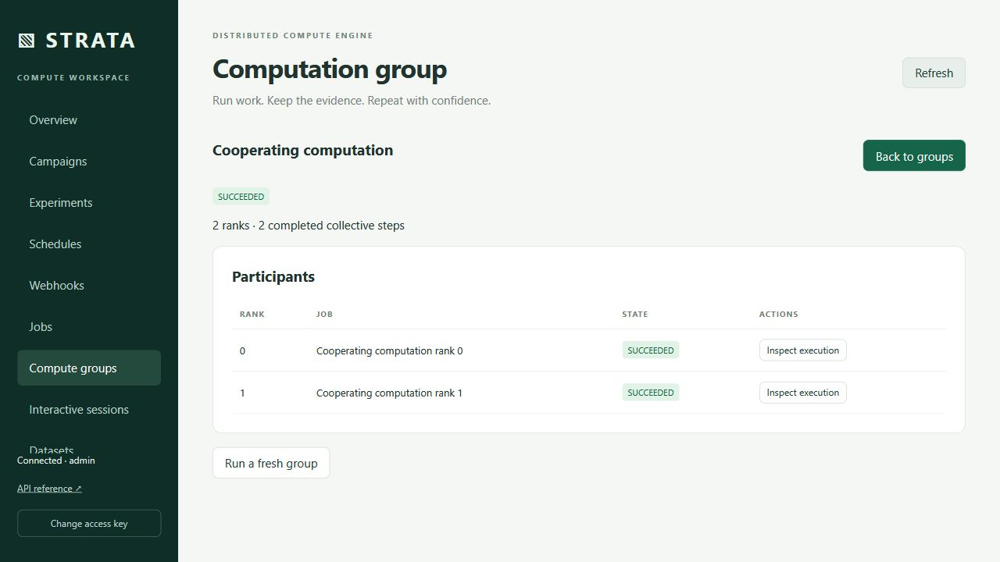
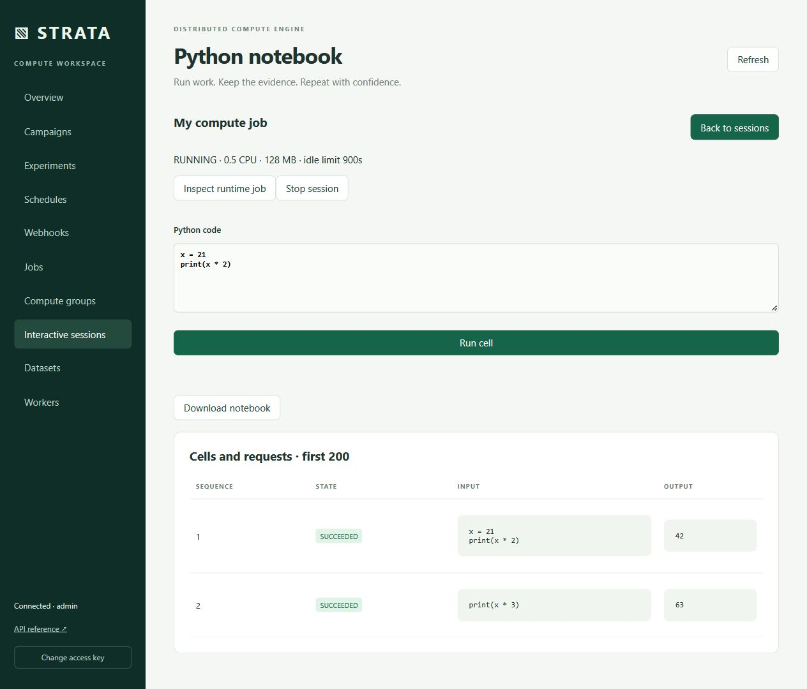

# Cooperating computation and interactive runtimes

Strata can reserve a cooperating group of 2–16 distinct workers in one PostgreSQL transaction. Each rank runs an allowlisted container with its own lease, CPU/RAM/GPU reservation, sealed inputs, bounded output volume, logs and artifacts. A group waits without partial reservations until every rank fits. Project budgets apply to the entire group. The local CPU pool estimates distinct nodes rather than packing two group ranks onto one agent; the scheduler remains authoritative.

## Compute groups



Use **Compute groups → Create group**, `strata groups submit group.yaml --idempotency-key study-1`, or `Client.submit_group(...)`. A specification contains `name`, `nodes` and a per-rank `job`. Group inputs must be sealed dataset versions or pinned terminal artifacts. Each rank gets a stable group ID, rank and size through `STRATA_RUNTIME_CONTEXT`. The installed, dependency-free Python helper is `/output/.strata/runtime.py`:

```python
import sys

sys.path.insert(0, "/output/.strata")
from runtime import Collective

collective = Collective()
local_value = float(collective.rank + 1)
total = collective.reduce([local_value], operation="sum")[0]
collective.barrier()
print(collective.rank, total)
```

Every rank must submit the same ordered operations with matching vector widths. Supported operations are barriers and vector `sum`, `min` and `max`; reductions accept 1–256 finite numbers, and a group accepts at most 1,024 collective steps. Results are persisted in PostgreSQL, with idempotent contributions and conflicting replay rejection. Ranks communicate through bounded files relayed by their trusted agents over the authenticated RPC channel. Workload containers have no network access and receive no worker token or lease credentials. Both Python and C++ agents implement the bridge. A custom non-Python workload can implement the same JSON file protocol; the bundled workload helper requires Python.

A failing, timed-out, lost or cancelled participant cancels its peers. Leases fence stale agents and reservations are released by the existing durable execution contract. Individual automatic retries are disabled for ranks. `strata groups retry GROUP_ID IDEMPOTENCY_KEY` creates a fresh group only after every previous rank is terminal, preventing stale collective contributions from crossing executions. A direct job retry of a rank is rejected. Cancellation of one rank requests cancellation of its whole group.

The runtime is intended for bounded, coordinator-mediated cooperation, such as parallel numerical integration or iterative parameter reductions. It does not provide MPI, RDMA, peer TCP sockets, a distributed filesystem or low-latency tensor training. Distinct worker identities can be hosted on one physical machine. The local end-to-end check computes an integral using a Python agent and a C++ agent together and validates both transferred results; this establishes logical multi-node execution, not physical scale or network throughput.

## Python notebooks



Use **Interactive sessions → Start Python notebook**, `strata sessions create session.yaml`, or `Client.create_session(...)` with `kind: python`. The `job` determines the approved image, resources, pinned image, inputs and maximum runtime; its command is replaced by the managed kernel. The image must contain Python. The kernel preserves a Python namespace between cells, captures bounded stdout/stderr, records exceptions without discarding the namespace, and publishes files from `/output` when the session stops. Sealed datasets remain under `/inputs`.

Submit code through the web form, `strata sessions execute SESSION_ID cell.py IDEMPOTENCY_KEY`, or `Client.execute_cell(...)`. Each session accepts at most 1,000 messages and one outstanding message at a time. A cell accepts at most 8 KiB of UTF-8 code, captures at most 4 KiB on each output stream, and has a 1–300 second deadline. A lost HTTP reply can be retried with the same key without executing the cell twice. A conflicting key is rejected. A kernel lost with its worker is closed rather than replayed into a different Python namespace.

Download the standard `.ipynb` export from the session page, `strata sessions export SESSION_ID output.ipynb`, or `Client.export_notebook(...)`. The export includes code, bounded stream output, execution order and Strata session/job provenance. This is a managed Python kernel and notebook export; it does not embed a JupyterLab server, rich MIME output or arbitrary notebook extensions. Plots can be written to `/output` and retrieved as ordinary artifacts after stopping the session.

## Container-local HTTP services

Create `kind: service` with a Python-capable approved image, a `job.command` that starts the service and `service_port` in 1024–65535. The managed wrapper launches that command in the same constrained container. Access it from **Interactive sessions**, `strata sessions proxy ...`, or `Client.service_request(...)`. Requests use the same authorization and idempotent message lifecycle as cells.

The proxy accepts only a relative path on the configured container-local port. It disables ambient proxies and redirects, publishes no host port, sends no platform credentials, accepts at most 4 KiB of request body and returns at most 8 KiB of response body with a bounded content type. HTTP methods are GET, HEAD, POST, PUT, PATCH and DELETE. Responses are returned as JSON metadata and base64 bytes; the web console displays them as text. It does not execute returned HTML, grant arbitrary URL access, tunnel WebSockets or expose an unrestricted service origin. A service failure is surfaced as a failed message or a terminal runtime job.

## Lifecycle and upgrade

Every session has an idle timeout of 10–3,600 seconds, a finite job runtime and ordinary project execution budgets. Reading status does not keep a session alive. Submitting and completing a message updates activity. An idle or overdue session requests cancellation; the agent stops the process and releases resources. A deadline closes the entire kernel because safely interrupting arbitrary native Python extensions is not guaranteed. Stop a session explicitly before collecting its final artifacts. If a worker or coordinator disappears, lease fencing and the independent host reaper remain required for orphan cleanup.

Migration **0017** adds groups, membership, collective rounds, interactive sessions and cells; 0016 preserves helper resource charges. Install matching coordinator and worker versions before enabling `runtime-bridge` workloads. Older workers do not advertise the capability and cannot receive these jobs. Pause admission/assignment, back up the database, apply `strata-admin migrate`, check the schema and perform the installed-package checks in [distribution and upgrades](distribution-and-upgrades.md). Maintain an external backup and retention policy for the database; the bounded per-session/per-group records do not replace history retention.

Automated checks are in `tests/integration/test_runtimes.py` and `tests/e2e/test_managed_runtimes.py`: atomic all-or-none reservation, concurrent schedulers on actual PostgreSQL, replay conflict rejection, group cancellation/loss, fresh group identities, kernel state, bounded output, notebook export, service access without published ports, idle closure and both agents. Physical multi-host measurements and arbitrary third-party notebook compatibility require separate deployment evidence.
